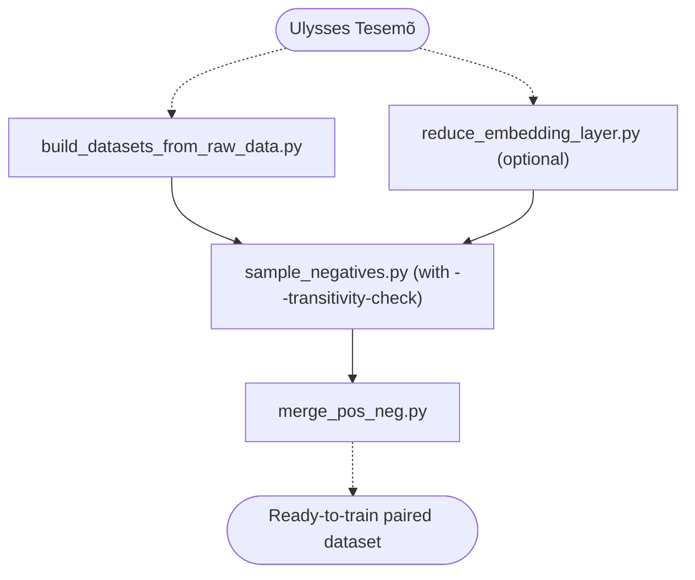
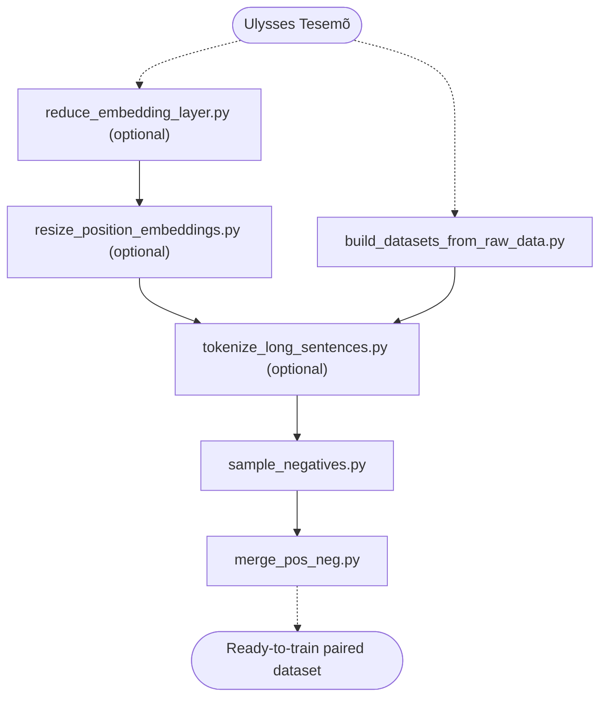

# ulysses-sbert-data-processing
Code for processing Ulysses SBERT training dataset.

Ready-to-use paired datasets can be found [here](https://cloud.andrelab.icmc.usp.br/s/5szom8Tawj24ZxQ).

Trained models are available in [Ulysses Fetcher](https://github.com/ulysses-camara/ulysses-fetcher).

---

## Intended pipeline
Scripts in this repository are intended to be run in the following order:

Build dataset of pairs of **short** segments:


Building datasets of pairs of **long** segments:


1. [`build_datasets_from_raw_data.py`](#build_datasets_from_raw_datapy);
2. [`reduce_embedding_layer.py`](#reduce_embedding_layerpy) (optional; only if specialization of multilingual models is wanted);
3. [`resize_position_embeddings.py`](#resize_position_embeddingspy) (optional; only if contexts larger than the base model context window are wanted);
4. [`tokenize_long_sentences.py`](#tokenize_long_sentencespy) (optional; only for long contexts);
5. [`sample_negatives.py`](#sample_negativespy); and
6. [`merge_pos_neg.py`](#merge_pos_negpy).

You can run any script listed above as `python script.py --help` to get documentation of available parameters.

---

### `build_datasets_from_raw_data.py`
*Gist:* Generate pairs of semantically connected segments from [Tesemõ corpus](https://github.com/ulysses-camara/ulysses-tesemo).

*Note:* The following corpora must be available locally before running this script:
- Two Tesemõ's subsets (path searched by default is `--tesemo-path=./tesemo_v2.1`):
  - Tesemõ's subset "legislativo" (searched at `./tesemo_v2.1/legislativo`);
  - Tesemõ's subset "outros" (searched at `./tesemo_v2.1/outros`); and
- A complementary dataset available [here](https://cloud.andrelab.icmc.usp.br/s/McLJ6KyWAdKPiEd) (path searched by default is `--complementary-data-path=./ulysses_sbert_complementary_pair_data`). 

Also, don't forget to unzip the data after downloading it.

*Note:* ready-to-use paired datasets, used to train Ulysses Sentence Models currently available in [Ulysses Fetcher](https://github.com/ulysses-camara/ulysses-fetcher), can be found [here](https://cloud.andrelab.icmc.usp.br/s/5szom8Tawj24ZxQ).

*Command format:*
```bash
python build_datasets_from_raw_data.py
```

*Examples:*

Generating pairs of short segments: 
```bash
python build_datasets_from_raw_data.py
```

Generating pairs of long segments: 
```bash
python build_datasets_from_raw_data.py --long-segments
```

*Output:* file in TSV format (tab-separated values) with all generated pairs. Contains three columns: `sentence_a`, `sentence_b`, and `source`.

---

### `reduce_embedding_layer.py`
*Gist:* remove uncommon tokens from SBERT's embedding layer, reducing model size, based on the frequency computed from a reference dataset provided.

*Note:* Useful to reduce the size of large multilingual sentence models.

*Command format:*
```bash
python reduce_embedding_layers.py \
    model_uri \
    corpora_uris \
    --new-dict-size=n \
    --word-embedding-submodule-name="name" \
    --output-dir="my/output/dir/path"
```

*Example:*
```bash
python reduce_embedding_layers.py \
    path/to/sbert \
    tesemo_v2.1/legislativo/ \
    tesemo_v2.1/outros/ \
    --new-dict-size=30000 \
    --word-embedding-submodule-name="auto_model.embeddings.word_embeddings" \
    --output-dir="./reduced_models"
```

*Output:* SBERT with reduced embedding layer.

---

### `resize_position_embeddings.py`
*Gist:* Expand the number of positional tokens in an SBERT model.

*Note:* The newly inserted positions must be trained in order to be useful. Recommended only for training with (very) long sentences. 

*Command format:*
```bash
python resize_position_embeddings.py sbert_input_uri sbert_output_uri new_num_tokens
```

*Example:*
```bash
python resize_position_embeddings.py path/to/my/sbert my/output/path 1024
```

*Output:* SBERT with expanded context window.

---

### `tokenize_long_sentences.py`
*Gist:* split too long contexts into multiple instances such that no training data is lost due to truncation.

*Note:* Recommended only for training data composed of long sentences.

*Command format:*
```bash
python tokenize_long_sentences.py input_uri output_uri sbert_uri
```

*Example:*
```bash
python tokenize_long_sentences.py pairs_long_segments.tsv positive_pairs.tsv path/to/sbert/model
```

*Output:* file formatted similar to the input file. Longer sentences are either truncated (`sentence_a`) or split into multiple instances (`sentence_b`), whevener possible.

---

### `sample_negatives.py`
*Gist:* produce random negative pairs from positive pairs.

*Command format:*
```bash
python sample_negatives.py input_uri output_uri
```

*Examples:*

For pairs composed of sentences with small context window (often just a few tokens):
```bash
python sample_negatives.py positive_pairs.tsv negative_pairs.tsv --transitivity-check
```

For pairs composed of longer sentences:
```bash
python sample_negatives.py positive_pairs.tsv negative_pairs.tsv
```

*Output:* file formatted similar to the input file. Pairs are composed of random semantically dissimilar sentences.

---

### `merge_pos_neg.py`
*Gist:* merge positive and negative pairs, and insert labels (`1`: positive; `0`: negative).

*Command format:*
```bash
python merge_pos_neg.py positive_pairs_uri negative_pairs_uri output_uri
```

*Example:*
```bash
python merge_pos_neg.py positive_pairs.tsv negative_pairs.tsv pairs.tsv
```

*Output:* file formatted similar to the input file. Positive and negative pairs will be concatenated and labeled.
